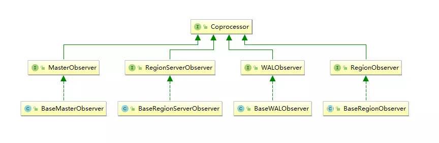
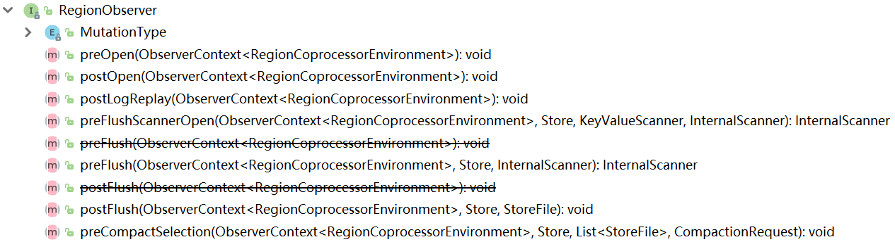
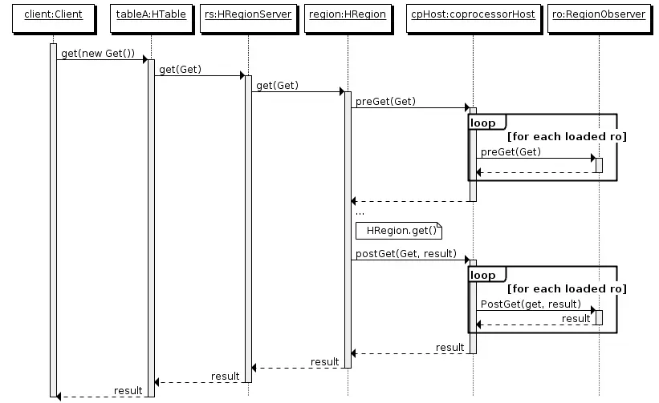

# HBase 协处理器

## 1 简述

>在使用 HBase 时，如果数据量达到了数十亿行或数百万列，此时能否在查询中返回大量数据将受制于网络的带宽，即便网络状况允许，但是客户端的计算处理也未必能够满足要求。
>
>在这种情况下，协处理器（Coprocessors）应运而生。它允许将业务计算代码放入在 RegionServer 的协处理器中，将处理好的数据再返回给客户端，这可以极大地降低需要传输的数据量，从而获得性能上的提升。同时协处理器也允许用户扩展实现 HBase 目前所不具备的功能，如权限校验、二级索引、完整性约束等。

## 2 协处理器的类型

### 2.1 Observer 协处理器类型

#### 2.1.1 具体功能

Observer 协处理器类似于关系型数据库中的触发器（trigger），当发生某些事件的时候，这类协处理器会被 Server 端调用，通常用来实现如下功能：

- **权限校验：**在执行 Get 或 Put 操作之前，我们可以使用 preGet 或 prePut 方法来检查权限
- **完整性约束：**HBASE 不支持关系型数据库中的外键功能，可以通过 prePut 或 preDelete 方法在插入或删除数据的时候，对关联的数据进行检查
- **二级索引：**可以使用协处理器来维护二级索引

#### 2.1.2 Observer 协处理器的类型

当前的 Observer 协处理器有以下四种类型：

- **RegionObserver：**用来监控 Region 上的事件，比如 Get 和 Put 操作
- **RegionServerObserver：**用来监控与 RegionServer 操作相关的事件，比如启动，停止或执行合并，提交或回滚操作
- **MasterObserver：**用来监控与 HBaser Master 相关的事件，比如表创建，删除或 Schema 修改操作
- **WalObserver：**用来监控与预写日志（WAL）相关的事件

#### 2.1.3 接口定义

以上四种类型的 Observer 协处理器均继承自 `Coprocessor` 接口，这四个接口中分别定义了所有可用的钩子方法，以便在对应方法前后执行特定的操作。

通常情况下，我们并不会直接实现上面接口，而是继承其 Base 实现类，Base 实现类只是简单空实现了接口中的方法，这样我们在实现自定义的协处理器时，就不必实现所有方法，只需要重写必要方法即可。



以 RegionObserver 为例，其接口类中定义了所有可用的钩子方法，以下是部分方法：



#### 2.1.4 执行流程



1. 客户端发出 Get 请求
2. 该请求被分派给合适的 RegionServer 和 Region
3. CoprocessorHost 拦截该请求，然后在该表的每个 RegionObserver 上调用 preGet() 方法
4. 如果没有被 preGet()　拦截，该请求将继续发送到 Region，然后进行处理
5. Region 产生的结果再次被 CoprocessorHost 拦截，调用 postGet() 方法
6. 假如没有被 postGet() 拦截，则将最终结果返回给客户端

上述方式可以类比如 Spring 中的 AOP 原理。

### 2.2 Endpoint 协处理器

Endpoint 协处理器类似于关系型数据库中的存储过程。客户端可以调用 Endpoint 协处理器在服务端对数据进行处理，然后再返回。

以聚合操作为例，如果没有协处理器，当用户需要找出一张表中的最大数据，即 max 聚合操作，就必须进行全表扫描，然后在客户端上遍历扫描结果，这必然会加重了客户端处理数据的压力。

利用 Coprocessor，用户可以将求最大值的代码部署到 HBase Server 端，HBase 将利用底层 cluster 的多个节点并发执行求最大值的操作。即在每个 Region 范围内执行求最大值的代码，将每个 Region 的最大值在 Region Server 端计算出来，仅仅将该 max 值返回给客户端。之后客户端只需要将每个 Region 的最大值进行比较而找到其中最大的值即可。

## 3 协处理器的加载方式

要使用我们自己开发的协处理器，必须通过静态（使用 HBase 配置）或动态（使用 HBase Shell 或 Java API）加载。

- 静态加载的协处理器称为 System Coprocessor（系统级协处理器），作用范围是整个 HBase 上的所有表，需要重启 HBase 服务
- 动态加载的协处理器称为 Table Coprocessor（表级处理器），作用于指定的表，不需要重启 HBase 服务（**注意**，当我们自己写的类处理器内容有变动时，当我们重新提交了 jar 包，则需要重启 HBase 服务，此处应该是 HBase 在加载过一个协处理器后，自己进行了缓存，以后再调用时不再去 HDFS 上获取  jar 包）

### 3.1 静态加载与卸载

#### 3.1.1 静态加载

静态加载方式分为以下三步：

1. 在 `hbase-site.xml` 中定义需要加载的协处理器：

```xml
<property>
    <name>hbase.coprocessor.region.classes</name>
   <value>org.gldwolf.hbaseobserver.MyRegionObserver</value>
</property>
```

`<name>` 标签的值必须是下面值中的一个：

- RegionObserver 和 Endpoint 协处理器：`hbase.coprocessor.region.classes`
- WALObservers 协处理器：`hbase.coprocessor.wal.classes`
- MasterObservers 协处理器：`hbase.coprocessor.master.classes`

`<value>` 必须是协处理器实现类的完全限定名。如果指定了多个协处理器，则类名必须以逗号分隔。

2. 将 jar（包含代码和所有依赖项）放入 HBase 安装目录中的 `lib` 目录下
3. 重启 HBase

#### 3.1.2 静态卸载

1. 从 `hbase-site.xml` 中删除配置的协处理器的 <property> 元素及其子元素
2. 从类路径或 HBase 的 lib 目录中删除协处理器的 jar 文件（可选）
3. 重启 HBase

### 3.2 动态加载与卸载

使用动态加载协处理器，不需要重新启动 HBase。

动态加载的协处理器是基于每个表加载的，只能用于所指定的表。 此外，在使用动态加载必须使表脱机（disable）以加载协处理器。动态加载通常有两种方式：Shell 和 Java API 。

**在使用动态加载时，要将 Jar 包放在 HDFS 上。**

#### 3.2.1 HBase Shell 动态加载

1. 使用 HBase Shell 禁用表：

```shell
hbase> disable 'tableName'
```

2. 加载协处理器：

```shell
alter 'tableName', METHOD => 'table_att', 'Coprocessor'=>'hdfs://192.168.4.5:8020/tmp/jars/hbaseobserver-1.0-SNAPSHOT-jar-with-dependencies.jar|com.dky.bigdata.MyRegionObserver|1073741823|arg1=1,arg2=2' 
```

`Coprocessor` 包含由管道符（|）分隔的四个参数，按顺序解释如下：

- **JAR 包路径：**通常 JAR 包存入在 HDFS 上。关于路径有以下两点注意：
  - 允许使用通配符，例如：`hdfs://<namenode>:<port>/tmp/jars/*.jar` 来添加指定的 JAR 包
  - 可以使用指定目录，例如：`hdfs://<namenode>:<port>/tmp/jars/`，这会添加该目录下的所有 JAR 包，但是不会搜索子目录下的 JAR 包
- **类名：**协处理器的完全限定类名
- **优先级：**协处理器的优先级，遵循数字的自然顺序，即值越小优先级越高。可以为空，在这种情况下，将分配默认优先级的值
- **可选参数：**传递的协处理器的可选参数

3. 启用表

```shell
hbase> enable 'tableName'
```

4. 验证协处理器是否已加载成功

```shell
hbase> describe 'tableName'
```

协处理器出现在 `TABLE_ATTRIBUTES` 属性中则代表加载成功。

#### 3.2.2 HBase Shell 动态卸载

1. 禁用表

```shell
hbase> disable 'tableName'
```

2. 移除协处理器

```shell
hbase> alter 'tableName', METHOD => 'table_att_unset', NAME => 'coprocessor$1'
```

3. 启用表

```shell
hbase> enable 'tableName'
```

4. 验证协处理器是否已移除

```shell
hbase> desc 'tableName'
```

#### 3.2.3 Java API 动态加载

```java
TableName tableName = TableName.valueOf("traffic");
String path = "hdfs://<namenode>:<port>/tmp/jars/MyRegionObserver.jar";
Configuration conf = HBaseConfiguration.create();
Connection connection = ConnectionFactory.createConnection(conf);
Admin admin = connection.getAdmin();
admin.disableTable(tableName);
HTableDescriptor hTableDescriptor = new HTableDescriptor(tableName);
HColumnDescriptor columnFamily1 = new HColumnDescriptor("personalDet");
columnFamily1.setMaxVersions(3);
hTableDescriptor.addFamily(columnFamily1);
HColumnDescriptor columnFamily2 = new HColumnDescriptor("salaryDet");
columnFamily2.setMaxVersions(3);
hTableDescriptor.addFamily(columnFamily2);
hTableDescriptor.setValue("COPROCESSOR$1", path + "|" + RegionObserverExample.class.getCanonicalName() + "|"
+ Coprocessor.PRIORITY_USER);
admin.modifyTable(tableName, hTableDescriptor);
admin.enableTable(tableName);
```

在 HBase 0.96 及其以后的版本中，HTableDescriptor 的 addCoprocessor() 方法提供了一种更为简便的加载方法。

```java
TableName tableName = TableName.valueOf("traffic"); // 表名
Path path = new Path("hdfs://<namenode>:<port>/tmp/jars/MyRegionObserver.jar"); // jar 包地址

Configuration conf = HBaseConfiguration.create();
Connection connection = ConnectionFactory.createConnection(conf);
Admin admin = connection.getAdmin();
admin.disableTable(tableName); // 禁用表

HTableDescriptor hTableDescriptor = new HTableDescriptor(tableName);
HColumnDescriptor columnFamily = new HColumnDescriptor("personalDet");
hTableDescriptor.addFamily(columnFamily1);
HColumnDescriptor columnFamily2 = new HColumnDescriptor("salaryDet");
hTableDescriptor.addFamily(columnFamily2);

hTableDescriptor.addCoprocessor(MyRegionObserver.class.getCanonicalName(), path,
Coprocessor.PRIORITY_USER, null); // 添加表的协处理器

admin.modifyTable(tableName, hTableDescriptor); // 修改表的 scheme
admin.enableTable(tableName); // 启用表
```

#### 3.2.4 Java API 动态卸载

卸载其实就是重新定义表，但不设置协处理器，这一操作将会删除表上的所有协处理器。

```java
TableName tableName = TableName.valueOf("traffic");
String path = "hdfs://<namenode>:<port>/tmp/jars/MyRegionObserver.jar";
Configuration conf = HBaseConfiguration.create();
Connection connection = ConnectionFactory.createConnection(conf);
Admin admin = connection.getAdmin();
admin.disableTable(tableName);
HTableDescriptor hTableDescriptor = new HTableDescriptor(tableName);
HColumnDescriptor columnFamily1 = new HColumnDescriptor("personalDet");
columnFamily1.setMaxVersions(3); // 设置版本数
hTableDescriptor.addFamily(columnFamily1);
HColumnDescriptor columnFamily2 = new HColumnDescriptor("salaryDet");
columnFamily2.setMaxVersions(3);
hTableDescriptor.addFamily(columnFamily2);
admin.modifyTable(tableName, hTableDescriptor);
admin.enableTable(tableName);
```

## 4 协处理器编程实战

## 4.1 导入的依赖

```xml
<dependency>
    <groupId>org.apache.hbase</groupId>
    <artifactId>hbase-common</artifactId>
    <version>1.2.6</version>
</dependency>
<dependency>
    <groupId>org.apache.hbase</groupId>
    <artifactId>hbase-server</artifactId>
    <version>1.2.6</version>
</dependency>
```

### 4.2 在 Put 操作之后将 Put 的数据 copy 一份到 ES 中

```java
package com.dky.bigdata;

import org.apache.hadoop.hbase.Cell;
import org.apache.hadoop.hbase.CellUtil;
import org.apache.hadoop.hbase.client.Durability;
import org.apache.hadoop.hbase.client.Put;
import org.apache.hadoop.hbase.coprocessor.BaseRegionObserver;
import org.apache.hadoop.hbase.coprocessor.ObserverContext;
import org.apache.hadoop.hbase.coprocessor.RegionCoprocessorEnvironment;
import org.apache.hadoop.hbase.regionserver.wal.WALEdit;
import org.apache.hadoop.hbase.util.Bytes;
import org.apache.log4j.Logger;

import java.io.IOException;
import java.util.List;

public class MyRegionObserver extends BaseRegionObserver {

    private static final Logger LOGGER = Logger.getLogger(MyRegionObserver.class);

    @Override
    public void prePut(ObserverContext<RegionCoprocessorEnvironment> observerContext, Put put, WALEdit walEdit, Durability durability) throws IOException {
    }

    @Override
    public void postPut(ObserverContext<RegionCoprocessorEnvironment> observerContext, Put put, WALEdit walEdit, Durability durability) throws IOException {

        byte[] row = put.getRow();
        List<Cell> nickNames = put.get(Bytes.toBytes("content"), Bytes.toBytes("nick_name"));
        List<Cell> contents = put.get(Bytes.toBytes("content"), Bytes.toBytes("content"));
        List<Cell> repostNums = put.get(Bytes.toBytes("content"), Bytes.toBytes("repost_num"));
        List<Cell> commentNums = put.get(Bytes.toBytes("content"), Bytes.toBytes("comment_num"));
        List<Cell> likeNums = put.get(Bytes.toBytes("content"), Bytes.toBytes("like_num"));
        List<Cell> createDates = put.get(Bytes.toBytes("content"), Bytes.toBytes("create_date"));
        List<Cell> createTimes = put.get(Bytes.toBytes("content"), Bytes.toBytes("create_time"));
        List<Cell> nouns = put.get(Bytes.toBytes("content"), Bytes.toBytes("noun"));
        List<Cell> prices = put.get(Bytes.toBytes("content"), Bytes.toBytes("price"));
        List<Cell> synthesiss = put.get(Bytes.toBytes("content"), Bytes.toBytes("synthesis"));


        // 将所有的值转换成字符串
        // 使用 CellUtil.cloneValue(Cell) 来获取 cell 的值
        String rowKey = Bytes.toString(row);
        String nickNameStr = Bytes.toString(CellUtil.cloneValue(nickNames.get(0)));
        String contentsStr = Bytes.toString(CellUtil.cloneValue(contents.get(0)));
        String repostNumStr = Bytes.toString(CellUtil.cloneValue(repostNums.get(0)));
        String commentNumStr = Bytes.toString(CellUtil.cloneValue(commentNums.get(0)));
        String likeNumStr = Bytes.toString(CellUtil.cloneValue(likeNums.get(0)));
        String createDateStr = Bytes.toString(CellUtil.cloneValue(createDates.get(0)));
        String createTimeStr = Bytes.toString(CellUtil.cloneValue(createTimes.get(0)));
        String nounStr = Bytes.toString(CellUtil.cloneValue(nouns.get(0)));
        String priceStr = Bytes.toString(CellUtil.cloneValue(prices.get(0)));
        String synthesisStr = Bytes.toString(CellUtil.cloneValue(synthesiss.get(0)));

        String[] indexRecord = new String[11];
        indexRecord[0] = rowKey;
        indexRecord[1] = nickNameStr;
        indexRecord[2] = contentsStr;
        indexRecord[3] = repostNumStr;
        indexRecord[4] = commentNumStr;
        indexRecord[5] = likeNumStr;
        indexRecord[6] = createDateStr;
        indexRecord[7] = createTimeStr;
        indexRecord[8] = nounStr;
        indexRecord[9] = priceStr;
        indexRecord[10] = synthesisStr;

        ESUtil.insertIndex("traffic", indexRecord);
    }
}

```

## 参考资料
1. https://juejin.im/post/5d85938f5188254f0a1ed64b
