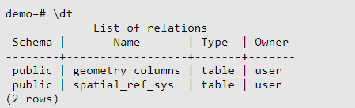
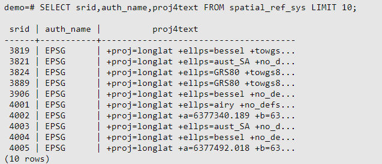
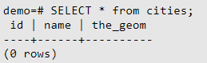
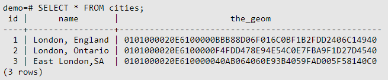
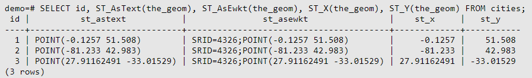
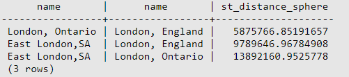
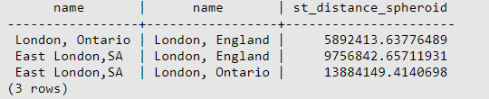

# PostGIS 入门

> PostGIS 是 PostgreSQL  关系数据库的空间操作扩展。它为 PostgreSQL 提供了存储、查询和修改空间关系的能力。

## PostgreSQL 使用

### 创建数据库

1. **打开 PostgreSQL 终端**

``` shell
psql -U username -W password
```

2. **创建数据库**（创建一个带有  PostGIS 扩展功能的数据库，因此需要指定一个相应的模板）：

```
createdb -T template_postgis dbname
```

3. **删除数据库**：首先使用 `dropdb` 命令删除之前的数据库，然后使用 `psql` 命令开启 SQL 命令解析器

```sql
dropdb demo
psql -d postgres
```

这样就连接到了一个通用的系统数据库 `postgres`。输入 SQL 命令建立新数据库：

```SQL
CREATE DATABASE demo TEMPLATE=template_postgis;
```

4. **连接到新的数据库**：可以使用  `psql -d demo` 命令。但是在 psql 终端里也可以使用如下命令：

```sql
\c demo
```

5. **列出当前数据库的所有表**：

```sql
\dt
```



这两个表格是 PostGIS 默认的。其中 spatial_ref_sys 存储着合法的空间坐标系统。利用 sql 查询查看内容：



表 geometry_columns 用于记录哪些表格是有空间信息的。

### 创建表并插入数据

空间数据库已经创建完毕，下面建立一个具有空间信息的表格：

首先建立一个常规的表格存储有关城市（cities）的信息。表格有两列，一个是 ID 编号，一个是城市名：

```sql
CREATE TABLE cities(id int4, name varchar(50));
```

**添加一列用于存储城市的位置信息**。习惯上列名叫做 `the_geom` 。它记录了数据使用的空间坐标系统、数据的类型（点、线、面）以及是几维的（此处使用 EPSG:4326坐标系统）：

```sql
SELECT AddGeometryColumn('cities', 'the_geom', 4326, 'POINT', 2);
```

完成后，查询 cities 表单应当显示这个新字段：



添加记录：需要使用 SQL 命令，对于空间栏，使用 PostGIS 的 `ST_GeomFromText` 可以将文本转化为坐标与参考系编号的记录：

```sql
INSERT INTO cities (id, the_geom, name) VALUES (1,ST_GeomFromText('POINT(-0.1257 51.508)',4326),'London, England');
INSERT INTO cities (id, the_geom, name) VALUES (2,ST_GeomFromText('POINT(-81.233 42.983)',4326),'London, Ontario');
INSERT INTO cities (id, the_geom, name) VALUES (3,ST_GeomFromText('POINT(27.91162491 -33.01529)',4326),'East London,SA');
```

### 简单查询

标准的 SQL 操作都可以用于 PostGIS 表单：



这里的坐标是无法阅读的 16 进制格式，要以 WKT 文本显示，使用 ST_AsText(the_geom) 或 `ST_AsEwkt(the_geom)` 函数。也可以使用 `ST_X(the_geom)` 和 `ST_Y(the_geom)` 显示一个维度的坐标：



### 空间查询

PostGIS 为 PostgreSQL 扩展了许多空间操作功能。上面已经涉及了转换空间坐标格式的 ST_GeomFromText。多数空间操作以 ST（Spatial Type）开头。

下面做一个具体的样例：以米为单位，并假设地球是一个完美的椭球，上面这三个城市的相互距离是多少？

```sql
SELECT p1.name, p2.name, ST_Distance_Sphere(p1.the_geom, p2.the_geom) cities AS p1, cities AS p2 where p1.id > p2.id;
```



输出显示了距离数据。注意 "WHERE" 部分防止了输出城市到自身的距离（0）或者两个城市不同排列的距离数据。

若采用不同的椭球参数（椭球体名、半轴长、扁率）计算：

```sql
SELECT p1.name, p2.name, ST_Distance_Spheroid(p1.the_geom, p2.the_geom, 'SPHEROID["GRS_1980", 6378137, 298.25722]') FROM cities AS p1, cities AS p2 WHERE p1.id > p2.id;
```

