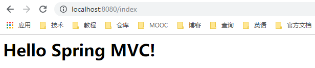
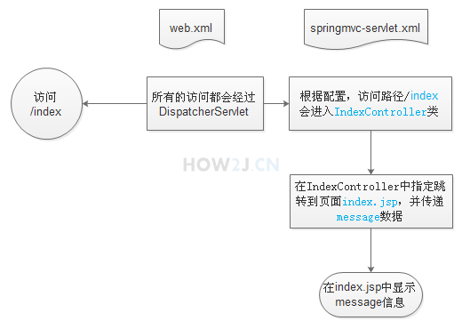
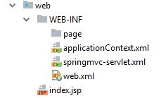
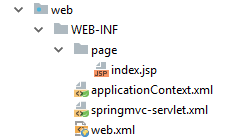

# Spring MVC 入门

## 1 Spring MVC HelloWorld 入门示例

### 1.1 详细步骤

1. 在 WEB-INF 目录下创建 web.xml，配置 Spring MVC 的入口：DispatcherServlet，把所有的请求都传递给该 servlet。
2. **注意**：`<servlet-name>springmvc</servlet-name>` 表示该 servlet 的名字，这个名字会在后面用到。

**web.xml**

```xml
<?xml version="1.0" encoding="UTF-8"?>
<web-app xmlns="http://xmlns.jcp.org/xml/ns/javaee"
         xmlns:xsi="http://www.w3.org/2001/XMLSchema-instance"
         xsi:schemaLocation="http://xmlns.jcp.org/xml/ns/javaee http://xmlns.jcp.org/xml/ns/javaee/web-app_4_0.xsd"
         version="4.0">
    <context-param>
        <param-name>contextConfigLocation</param-name>
        <param-value>/WEB-INF/applicationContext.xml</param-value>
    </context-param>
    <listener>
        <listener-class>org.springframework.web.context.ContextLoaderListener</listener-class>
    </listener>
    <!-- 该 servlet 的名字为 springmvc，是一个 DispatcherServlet -->
    <servlet>
        <servlet-name>springmvc</servlet-name>
        <servlet-class>org.springframework.web.servlet.DispatcherServlet</servlet-class>
        <load-on-startup>1</load-on-startup>
    </servlet>
    <!-- 处理 / 目录下的所有请求 -->
    <servlet-mapping>
        <servlet-name>springmvc</servlet-name>
        <url-pattern>/</url-pattern>
    </servlet-mapping>
</web-app>
```

3. 创建一个与上面的 servlet 名字相同（`<servlet-name>springmvc</servlet-name>`）的配置文件，这个文件是 Spring MVC 的映射配置文件，表示访问路径为 `/index` 的请求都会交给 **id="indexContrller"** 的 Controller bean 处理，id="indexController" 的类为 "**IndexController**"：

**springmvc-servlet.xml**

```xml
<?xml version="1.0" encoding="UTF-8"?>
<beans xmlns="http://www.springframework.org/schema/beans"
       xmlns:xsi="http://www.w3.org/2001/XMLSchema-instance"
       xsi:schemaLocation="http://www.springframework.org/schema/beans http://www.springframework.org/schema/beans/spring-beans.xsd">
    <bean id="simpleUrlHandlerMappin" class="org.springframework.web.servlet.handler.SimpleUrlHandlerMapping">
        <property name="mappings">
            <props>
                <!-- 所有 /index 下的请求都交给 indexController 对象处理 -->
                <prop key="/index">indexController</prop>
            </props>
        </property>
    </bean>
    <!-- 表明 indexController 是类 IndexController 的实例 -->
    <bean id="indexController" class="org.gldwolf.controller.IndexController"></bean>

</beans>
```

4. 创建控制类 **IndexController**，控制类 IndexController 实现接口 Controller，提供方法 handleRequest 处理请求。**SpringMVC 通过 ModelAndView 对象把模型和视图结合在一起，而 Controller 又通过创建 ModelAndView 对象与它们结合在一起**：

```java
ModelAndView mav = new ModelAndView("index.jsp");
mav.addObject("message", "Hello Spring MVC");
```

**IndexController.java**

```java
package org.gldwolf.controller;

import org.springframework.web.servlet.ModelAndView;
import org.springframework.web.servlet.mvc.Controller;

import javax.servlet.http.HttpServletRequest;
import javax.servlet.http.HttpServletResponse;

/**
 * @author: Gldwolf
 * @email: ZengqiangZhao@sina.com
 * @date: 9/22/2019 10:46 AM
 */

public class IndexController implements Controller {
    @Override
    public ModelAndView handleRequest(HttpServletRequest httpServletRequest, HttpServletResponse httpServletResponse) throws Exception {
        ModelAndView mav = new ModelAndView("index.jsp"); // 与 index.jsp 视图结合在一起
        mav.addObject("message", "Hello Spring MVC!"); // 往模型中添加数据
        mav.addObject("title", "This is a test!");
        return mav; // 将视图（包含有模型中的数据）响应返回给客户端
    }
}
```

5. 在 WebContent 目录下创建视图 **index.jsp**（jsp: Java Server Page），index.jsp 很简单，通过 ELK 表达式显示 message和 title 的内容:

```jsp
<%@ page contentType="text/html;charset=UTF-8" language="java" %>
<html>
  <head>
    <title>${title}</title>
  </head>
  <h1>${message}</h1>
  </body>
</html>
```

6. 启动 Tomcat，访问 localhost:8080/index，观察效果：



### 1.2 原理解析

1. 用户访问 localhost:8080/index
2. 根据 web.xml 中的配置，所有的访问都会通过 DisptcherServlet
3. 根据 springmvc-servlet.xml 中的配置，访问路径 /index 的请求都会交由 IndexController 类来处理
4. 在 IndexController 中指定跳转到页面 index.jsp，并传递 message 和 title 数据
5. 在 index.jsp 中显示 message 和 title 的信息



## 2 视图定位

如果代码如上所示，表示跳转到页面 index.jsp：

```java
new ModelAndView("index.jsp")
```

所谓的视图定位就是指：如果代码还是写成这样，但是会跳转到 /WEB-INF/page/index.jsp：

```java
new ModelAndView("index")
```

修改之前的 springmvc-servlet.xml，增加如下内容：

```xml
<bean id="viewResolver" class="org.springframework.web.servlet.view.InternalResourceViewResolver">
   <property name="prefix" value="/WEB-INF/page/" />
   <property name="suffix" value=".jsp" />
</bean>
```

其作用是把视图限定在 **WEB-INF/page/*.jsp** 这个位置，完整的 springmvc-servlet.xml 配置文件如下：

```xml
<?xml version="1.0" encoding="UTF-8"?>
<beans xmlns="http://www.springframework.org/schema/beans"
       xmlns:xsi="http://www.w3.org/2001/XMLSchema-instance"
       xsi:schemaLocation="http://www.springframework.org/schema/beans http://www.springframework.org/schema/beans/spring-beans.xsd">

    <bean id="viewResolver" class="org.springframework.web.servlet.view.InternalResourceViewResolver">
        <property name="prefix" value="/WEB-INF/page/" />
        <property name="suffix" value=".jsp" />
    </bean>
    <bean id="simpleUrlHandlerMappin" class="org.springframework.web.servlet.handler.SimpleUrlHandlerMapping">
        <property name="mappings">
            <props>
                <prop key="/index">indexController</prop>
            </props>
        </property>
    </bean>
    <bean id="indexController" class="org.gldwolf.controller.IndexController"></bean>

</beans>
```

将 IndexController.java 文件作出如下修改：

```java
ModelAndView mav = new ModelAndView("index.jsp");
```

修改为：

```java
ModelAndView mav = new ModelAndView("index");
```

修改后的 **IndexController.java**

```java
package org.gldwolf.controller;

import org.springframework.web.servlet.ModelAndView;
import org.springframework.web.servlet.mvc.Controller;

import javax.servlet.http.HttpServletRequest;
import javax.servlet.http.HttpServletResponse;

/**
 * @author: Gldwolf
 * @email: ZengqiangZhao@sina.com
 * @date: 9/22/2019 10:46 AM
 */

public class IndexController implements Controller {
    @Override
    public ModelAndView handleRequest(HttpServletRequest httpServletRequest, HttpServletResponse httpServletResponse) throws Exception {
        ModelAndView mav = new ModelAndView("index");
        mav.addObject("message", "Hello Spring MVC!");
        mav.addObject("title", "This is a test!");
        return mav;
    }
}
```

将 index.jsp 文件移动到 /WEB-INF/page/ 目录下：

移动前：



移动后：



完成后的效果展示：


## 3 注解的配置方式

在类的前面添加 **@Controller** 注解，表示该类是一个控制器类，在 hadleRequest 方法前面加上 **@RequestMapping("/index")** 表示路径 /index 上的请求都会映射到该方法上：

**注意**：此时的 IndexController 类不需要再实现 Controller 接口

修改后的 **IndexController.java** 代码：

```java
package org.gldwolf.controller;

import org.springframework.stereotype.Controller;
import org.springframework.web.bind.annotation.RequestMapping;
import org.springframework.web.servlet.ModelAndView;

import javax.servlet.http.HttpServletRequest;
import javax.servlet.http.HttpServletResponse;

/**
 * @author: Gldwolf
 * @email: ZengqiangZhao@sina.com
 * @date: 9/22/2019 10:46 AM
 */

@Controller
public class IndexController {
    @RequestMapping("/index")
    public ModelAndView handleRequest(HttpServletRequest httpServletRequest, HttpServletResponse httpServletResponse) throws Exception {
        ModelAndView mav = new ModelAndView("index");
        mav.addObject("message", "Hello Spring MVC!");
        mav.addObject("title", "This is a test!");
        return mav;
    }
}
```

修改 springmvc-servlet.xml，添加如下代码，并注释掉原有的 java bean 配置：

```xml
<context:component-scan base-package="controller" />
```

```xml
<?xml version="1.0" encoding="UTF-8"?>
<beans xmlns="http://www.springframework.org/schema/beans"
       xmlns:xsi="http://www.w3.org/2001/XMLSchema-instance"
       xsi:schemaLocation="http://www.springframework.org/schema/beans http://www.springframework.org/schema/beans/spring-beans.xsd">

    <!-- 需要在配置文件中加入这行代码，这会让 spring 自动扫描这个包下的 bean 并添加到容器中，代替下面用 xml 配置 bean 方式 -->
    <context:component-scan base-package="controller" />
    
    <bean id="viewResolver" class="org.springframework.web.servlet.view.InternalResourceViewResolver">
        <property name="prefix" value="/WEB-INF/page/" />
        <property name="suffix" value=".jsp" />
    </bean>
    <!-- 注释如下配置项，改用注解的方式来替代 xml 配置
    <bean id="simpleUrlHandlerMappin" class="org.springframework.web.servlet.handler.SimpleUrlHandlerMapping">
        <property name="mappings">
            <props>
                <prop key="/index">indexController</prop>
            </props>
        </property>
    </bean>
    <bean id="indexController" class="org.gldwolf.controller.IndexController"></bean>
    -->

</beans>
```


