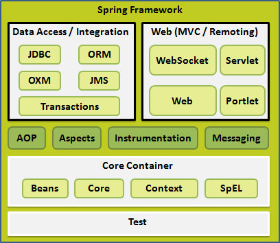

# Spring 入门

## 1 Spring 体系结构

### 1.1 体系结构

Spring 是模块化的，允许用户选择适用于自己的模块，不必要把剩余部分也引入。

Spring 框架提供了约 20 个模块，可以根据应用程序的要求来使用。



### 1.2 核心容器

核心容器由 spring-core, spring-beans, spring-context, spring-context-support 和 spring-expression（SpEL, Spring 表达式语言，Spring Expression Language）等模块组成，具体细节如下：

- **spring-core** 模块：提供了框架的基本组成部分，包括 IOC 和依赖注入功能。
- **spring-beans** 模块：提供了 BeanFactory，工厂模式的微妙实现，它移除了编码式单例的需要，并且可以把配置和依赖从实际编码逻辑中解耦。
- **context** 模块：建立在由 core 和 beans 模块的基础上，它是一种类似于 JNDI 注册的方式访问对象。Context 模块继承自 Bean 模块，并且添加了国际化（比如使用资源束）、事件传播、资源加载和透明地创建上下文（比如通过 Servelet 容器）等功能。Context 模块也支持 Java EE 功能，比如 EJB、JMX 和远程调用等。ApplicationContext 接口是 Context 模块的焦点。spring-context-support 提供了对第三方库集成到 Spring 上下文的支持，比如缓存（EhCache, Guava, JCache）、邮件（JavaMail）、高度（CommonJ, Quartz）、模板引擎（FreeMarker， JasperReports， Velocity）等。
- **spring-expression** 模块：提供了强大的表达式语言，用于在运行时查询和操作对象图。它是 JSP2.1 规范中定义的统一表达式语言的扩展，支持 set 和 get 属性值、属性赋值、方法调用、访问数组集合及索引的内容、逻辑算术运算、命名变量、通过名字从 Spring IOC 容器检索对象，还支持列表的投影选择以及聚合等。

它们之间的完整依赖关系如下图所示：


### 1.3 数据访问/集成

数据访问/集成层包括 JDBC, ORM, OXM, JMS 和事务处理模块，它们的细节如下：

> JDBC = Java Date Base Connectivity
>
> ORM = Object Relational Mapping
>
> OXM = Object XML Mapping
>
> JMS = Java Message Service

- **JDBC** 模块：提供了 JDBC 抽象层，它消除了冗长的 JDBC 编码和对数据库供应商特定错误代码的解析。
- **ORM** 模块：提供了对流行的对象关系映射  API 的集成，包括 JPA, JDO 和 Hibernate 等。通过此模块可以让这些 ORM 框架和 Spring 的其它功能整合，比如事务管理
- **OXM** 模块：提供了对 OXM 实现的支持，比如 JAXB, Castor, XML Beans, JiBX, XStream 等。
- **JMS** 模块：包含生产（produce）和消费（consume）消息的功能，从 Spring 4.1 开始，集成了 spring-messaging 模块。
- **事务** 模块：为实现特殊接口类及所有的 POJO 支持编程式和声明式事务管理。（注：编程式事务需要自己写 beginTransaction(), commit(), rollback() 等事务管理方法，声明式事务是通过注解或配置由 Spring 自动处理，编程式事务粒度更细） 

### 1.4 Web

Web 层是由 Web, Web-MVC, Web-Socket 和 Web-Portlet 组成，它们的细节如下：

- **Web** 模块：提供面向 Web 的基本功能和面向 Web 的应用上下文，比如多部分（multipart）文件上传功能、使用 Servlet 监听器初始化 IoC 容器等。它还包括 HTTP 客户端以及 Spring 远程调用中与 web 相关的部分。
- **Web-MVC** 模块：为 web 应用提供了模型视图控制（MVC） 和 REST Web 服务的实现。Spring 的 MVC 框架可以使领域模型代码和 web 表单完全地分离，且可以与 Spring 框架的其它所有功能进行集成。
- **Web-Socket** 模块：为 WebSocket-based 提供了支持，而且在 web 应用程序中提供了客户端和服务器端之间通信的两种方式。
- **Web-Portlet** 模块：提供了用于 Portlet 环境的 MVC 实现，并反映了 spring-webmvc 模块的功能。

### 1.5 其它

还有其他一些重要的模块，像 [AOP](https://www.w3cschool.cn/wkspring/izae1h9w.html)，Aspects，Instrumentation，Web 和测试模块，它们的细节如下：

- **AOP** 模块：提供了面向方面的编程实现，允许你定义方法拦截器和切入点对代码进行干净地解耦，从而使实现功能的代码彻底的解耦出来。使用源码级的元数据，可以用类似于.Net属性的方式合并行为信息到代码中。
- **Aspects** 模块：提供了与 **AspectJ** 的集成，这是一个功能强大且成熟的面向切面编程（AOP）框架。
- **Instrumentation** 模块：在一定的应用服务器中提供了类 instrumentation 的支持和类加载器的实现。
- **Messaging** 模块：为 STOMP 提供了支持作为在应用程序中 WebSocket 子协议的使用。它也支持一个注解编程模型，它是为了选路和处理来自 WebSocket 客户端的 STOMP 信息。
- **测试 **模块：支持对具有 JUnit 或 TestNG 框架的 Spring 组件的测试。

## 2 Spring 环境配置

### 2.1 依赖


### 2. 2 示例

创建一个 MainApp.java 类：

```java
package org.gldwolf;

import org.springframework.context.ApplicationContext;
import org.springframework.context.support.ClassPathXmlApplicationContext;

public class MainApp {
    public static void main(String[] args) {
        ApplicationContext context =
                new ClassPathXmlApplicationContext("Beans.xml");
        HelloWorld obj = (HelloWorld) context.getBean("helloWorld");
        obj.getMessage();
    }
}
```

创建一个 HelloWorld.java 的 Bean 类：

```java
package org.gldwolf;

public class HelloWorld {

    private String message;

    public void setMessage(String message){
        this.message  = message;
    }
    public void getMessage(){
        System.out.println("Your Message : " + message);
    }
}
```

创建一个 Beans.xml 配置文件：

```xml
<?xml version="1.0" encoding="UTF-8"?>
<beans xmlns="http://www.springframework.org/schema/beans"
       xmlns:xsi="http://www.w3.org/2001/XMLSchema-instance"
       xsi:schemaLocation="http://www.springframework.org/schema/beans http://www.springframework.org/schema/beans/spring-beans.xsd">
    
    <bean id="helloWorld" class="org.gldwolf.HelloWorld">
        <property name="message" value="Hello World"/>
    </bean>

</beans>
```

## 3 Spring IoC 容器

### 3.1 IoC 容器

Spring 容器是 Spring 框架的核心。容器将创建对象，把它们连接在一块，配置它们，并管理它们的整个生命周期的从创建到销毁。Spring 容器使用依赖注入（DI）来管理组成一个应用程序的组件。这些对象被称为 Spring Beans。

通过读取配置元数据（XML配置文件等）提供的指令，容器知道对哪些对象进行实例化，配置和组装。配置元数据可以通过 **XML**，**Java 注释**或 **Java 代码**来表示。

如下图所示：Spring IoC 容器利用 Java 的 POJO 类和配置元数据来生成完全配置和可执行的系统或应用程序。


**IOC 容器**：具有依赖注入功能，它可以创建对象，IOC 容器负责实例化、定位、配置应用程序中的对象及建立这些对象间的依赖。通常 new 一个实例，控制权由程序员控制，而 "控制反转" 是指 new 实例工作不由程序员来做而是交给 Spring 容器来做。在 Spring 中 BeanFactory 是 IOC 容器的实际代表者。

Spring 提供了以下两种不同类型的容器：

| **序号**                    | **容器 & 描述**                                              |
| --------------------------- | ------------------------------------------------------------ |
| **BeanFactory 容器**        | 最简单的窗口，给 DI 提供了基本的支持，它用 org.springframework.beans.factory.BeanFactory 接口来定义。BeanFactory 或者相关的接口，如 BeanFactoryAware，InitializingBean，DisposableBean，在 Spring 中仍然存在，主要目的是向后兼容已经存在的和那些 Spring 整合在一起的第三方框架。 |
| **ApplicationContext 容器** | 该容器添加了更多的企业特定的功能，例如从一个属性谢谢你的爱中解析文本信息的能力，发布应用程序事件给感兴趣的事件监听器的能力。该窗口是由 org.springframework.context.ApplicationContext 接口定义。 |

ApplicationContext 容器包括了 BeanFactory 容器的所有功能，所以一般使用 ApplicationContext 窗口。BeanFactory 仍然可以用于轻量级的应用程序，如移动设备或基于 applet 的应用程序，其中它的数据量的速度是显著的。

#### 3.1.1 Spring BeanFactory 容器

在 Spring  中，有大量对 BeanFactory 接口的实现。其中，最常用的是 **XmlBeanFactory** 类。这个容器从一个 XML 文件中读取配置元数据，由这些元数据来生成一个被配置化的系统或者应用。

示例：

```java
import org.springframework.beans.factory.InitializingBean;
import org.springframework.beans.factory.xml.XmlBeanFactory;
import org.springframework.core.io.ClassPathResource;
public class MainApp {
   public static void main(String[] args) {
      XmlBeanFactory factory = new XmlBeanFactory
                             (new ClassPathResource("Beans.xml"));
      HelloWorld obj = (HelloWorld) factory.getBean("helloWorld");
      obj.getMessage();
   }
}
```

在这段代码中，我们要注意两点：

- 第一步利用框架提供的 XmlBeanFactory API 来生成工厂 bean 以及利用 ClassPathResource() API 去加载路径 CLASSPATH 下可用的 bean 配置文件。XmlBeanFactory API 黄鹂创建并初始化所有的对象，即在配置文件中提到的 bean。
- 第二步利用第一步生成的 bean 工厂对象的 getBean() 方法得到所需要的 bean。这个方法通过配置文件中的 bean ID 来返回一个真正的对象，该对象作为最终使用的对象。一旦得到这个对象，就可以使用这个对象来调用任何方法。

#### 3.1.2 Spriing ApplicationContext 容器

ApplicationContext 是 BeanFactory 的子接口，也被称为 Spring 上下文对象。

ApplicationContext 是 Spring 中较高级的容器，和 BeanFactory 类似，它可以加载配置文件中定义的 bean，将所有的 bean 集中在一起，当有请求的时候就会分配 bean 对象。另外，如上面所说，它还增加企业所需的功能。

经常用的 ApplicationContext 接口的实现：

- FileSystemXmlApplicationContext：该容器从 XML 文件中加载已被定义的 bean。我们需要提供给构造器 XML 文件的完整路径。
- ClassPathXmlApplicationContext：该容器从 XML 文件中加载已被定义的 bean。我们不需要提供 XML 文件的完整路径，只需正确配置 CLASSPATH 环境变量即可，因为容器会从 CLASSPATH 中搜索 bean 的配置文件。
- WebXmlApplicationContext：该容器会在一个 web 应用程序的范围内加载在 XML 文件中已被定义的 bean。

示例：

```java
import org.springframework.context.ApplicationContext;
import org.springframework.context.support.FileSystemXmlApplicationContext;
public class MainApp {
   public static void main(String[] args) {
      ApplicationContext context = new FileSystemXmlApplicationContext
            ("C:/Users/55441/workspace/HelloSpring/src/Beans.xml");
      HelloWorld obj = (HelloWorld) context.getBean("helloWorld");
      obj.getMessage();
   }
}
```

### 3.2 Spring Bean

#### 3.2.1 Spring Bean 的定义

Bean 是构成应用程序的支柱，由 Spring IOC 容器管理。Bean 是一个被实例化、组装并通过 Spring IOC 容器所管理的对象。

Bean 由容器创建，容器需要知道配置元数据：

- 如何创建一个 bean
- bean 的生命周期的详细信息
- bean 的依赖关系

bean 具有如下属性：

|             属性             |                             描述                             |
| :--------------------------: | :----------------------------------------------------------: |
|          **class**           |        这个属性是必须的，指定用来创建 bean 的 bean 类        |
|           **name**           | 这个属性指定唯一的 bean 标识符。在基于 XML 的配置元数据中，可以使用 id 或 name 属性来指定 bean 唯一标识符 |
|          **scope**           |        这个属性指定特定的 bean 定义创建的对象的作用域        |
|     **constructor-arg**      |                      用来注入依赖关系的                      |
|        **properties**        |                      用来注入依赖关系的                      |
|     **autowiring mode**      |                      用来注入依赖关系的                      |
| **lazy-initialization mode** | 延迟初始化的 bean，告知 IOC 容器在它第一次被请求时才会创建这个 bean 的实例 |
|   **initialization 方法**    |      在 bean 的所有属性被容器设置之后，调用这个回调方法      |
|     **destruction 方法**     |         当包含该 bean 的容器被销毁时，使用该回调方法         |

```xml
<?xml version="1.0" encoding="UTF-8"?>

<beans xmlns="http://www.springframework.org/schema/beans"
    xmlns:xsi="http://www.w3.org/2001/XMLSchema-instance"
    xsi:schemaLocation="http://www.springframework.org/schema/beans
    http://www.springframework.org/schema/beans/spring-beans-3.0.xsd">

   <!-- A simple bean definition -->
   <bean id="..." class="...">
       <!-- collaborators and configuration for this bean go here -->
   </bean>

   <!-- A bean definition with lazy init set on -->
   <bean id="..." class="..." lazy-init="true">      
	<!-- collaborators and configuration for this bean go here -->
   </bean>

   <!-- A bean definition with initialization method -->
   <bean id="..." class="..." init-method="...">
       <!-- collaborators and configuration for this bean go here -->
   </bean>

   <!-- A bean definition with destruction method -->
   <bean id="..." class="..." destroy-method="...">
       <!-- collaborators and configuration for this bean go here -->
   </bean>

   <!-- more bean definitions go here -->

</beans>
```

##### Bean 与 Spring 容器的关系


##### Spring 配置元数据

Spring IOC 容器由实际编写的配置元数据实现解耦。有如下三种方法为 Spring 容器提供配置元数据：

- 基于 XML 的配置文件
- 基于注解的配置
- 基于 Java 的配置

#### 3.2.2 Spring Bean 的作用域

在定义一个 bean 时，必须声明该 bean 的作用域。例如，如果在每次请求的时候，都产生一个新的实例对象，那么就应该声明 bean 的作用域为  **prototype**。同样地，如果要返回同一个实例对象，那么该 bean 的作用域应该设置为 **singleton**。

Spring 框架支持以下 5 个作用域，如果使用 web-aware ApplicationContext 时，只有其中的三个是可用的：

|       作用域       |                             描述                             |
| :----------------: | :----------------------------------------------------------: |
|   **singleton**    | 在 Spring IOC 容器中只有一个 bean 实例，Bean 以单例的方式存在，这个作用域为默认的作用域 |
|   **prototype**    | 每次从容器中得到 Bean 时，都返回一个新的实例，即相当于 new 一个新对象 |
|    **request**     | 每次 HTTP 请求都会创建一个新的 Bean，该作用域仅适用于 WebApplicationContext 环境 |
|    **session**     | 同一个 HTTP Session 共享同一个 Bean 实例，不同的 Session 使用不同的实例对象，仅用于 WebApplicationContext 环境 |
| **global-session** | 一般用于 Portlet 应用环境，该作用域仅适用于 WebApplicationContext 环境 |

##### singleton 作用域：

singleton 是默认的作用域，即当定义 Bean 时，如果没有指定作用域配置项，则 Bean 的作用域默认为 singleton。

**Singleton 是单例类型，就是说在创建容器时就同时自动创建了这个  Bean 对象，不管是否使用，它都存在于容器中，每次获取这个对象时，都返回同一个实例。**如下所示，我们也可以在配置文件中设置作用域的属性为 singleton：

```xml
<!-- A bean definition with singleton scope -->
<bean id="..." class="..." scope="singleton">
    <!-- collaborators and configuration for this bean go here -->
</bean>
```

##### prototype 作用域：

当一个 bean 的作用域为 prototype 时，表示这个 bean 定义对应多个对象实例。每次对该 bean 请求（将其注入到另一个 bean，或者以程序的方式调用容器的 getBean() 方法）时，都会创建一个新的 Bean 实例。

**prototype 是原型类型，它在我们创建容器的时候并没有实例化，而是当我们获取 bean 时才会去创建一个对象，每次请求获取到的对象都是不同的实例对象。**

根据经验：**对有状态的 bean 应该使用 prototype 作用域，而对无状态的 bean 则应该使用 singleton 作用域**。

```xml
<!-- A bean definition with singleton scope -->
<bean id="..." class="..." scope="prototype">
   <!-- collaborators and configuration for this bean go here -->
</bean>
```

#### 3.2.3 Spring Bean 的生命周期

当一个 bean 被实例化时，它可能需要执行一些初始化使它转换成可用状态。同样，当 bean 不再需要，并且从容器中移除时，可能需要做一些清除工作。

为了定义安装和拆卸一个 bean 时的操作，我们只需要声明带有 **init-method** 和 **destroy-method** 参数。

init-method 属性指定一个方法，在实例化 bean 时，立即调用该方法。同样，destroy-method 指定一个方法，只有从容器中移除 bean 之后，才会调用这个方法。

Bean 的生命周期可以表达为：**Bean 的定义—— Bean 的初始化——Bean 的使用——Bean 的销毁**

##### 代码示例：

HelloWorld.java 代码

```java
public class HelloWorld {
   private String message;

   public void setMessage(String message){
      this.message  = message;
   }
   public void getMessage(){
      System.out.println("Your Message : " + message);
   }
   public void init(){
      System.out.println("Bean is going through init.");
   }
   public void destroy(){
      System.out.println("Bean will destroy now.");
   }
}
```

MainApp.java：在这是需要调用 Context 对象的 registerShutdownHook() 方法，它将确保正常关闭，并且调用相关的 destroy 方法。

```java
import org.springframework.context.support.AbstractApplicationContext;
import org.springframework.context.support.ClassPathXmlApplicationContext;
public class MainApp {
   public static void main(String[] args) {
      AbstractApplicationContext context = new ClassPathXmlApplicationContext("Beans.xml");
      HelloWorld obj = (HelloWorld) context.getBean("helloWorld");
      obj.getMessage();
      context.registerShutdownHook();
   }
}
```

Beans.xml

```xml
<?xml version="1.0" encoding="UTF-8"?>

<beans xmlns="http://www.springframework.org/schema/beans"
    xmlns:xsi="http://www.w3.org/2001/XMLSchema-instance"
    xsi:schemaLocation="http://www.springframework.org/schema/beans
    http://www.springframework.org/schema/beans/spring-beans-3.0.xsd">

   <bean id="helloWorld" 
       class="com.tutorialspoint.HelloWorld"
       init-method="init" destroy-method="destroy">
       <property name="message" value="Hello World!"/>
   </bean>

</beans>
```

如果有很多的 Bean 都有相同名称的初始化或者销毁方法，那么我们可以不需要在每一个 bean 上声明初始化方法和销毁方法。框架使用元素中的 **default-init-method** 和 **default-destroy-method** 属性提供了灵活配置这种情况，如下所示：

```xml
<beans xmlns="http://www.springframework.org/schema/beans"
    xmlns:xsi="http://www.w3.org/2001/XMLSchema-instance"
    xsi:schemaLocation="http://www.springframework.org/schema/beans
    http://www.springframework.org/schema/beans/spring-beans-3.0.xsd"
    default-init-method="init" 
    default-destroy-method="destroy">

   <bean id="..." class="...">
       <!-- collaborators and configuration for this bean go here -->
   </bean>

</beans>
```

#### 3.2.4 Spring Bean 后置处理器

**Bean 后置处理器允许在调用初始化方法前后对 Bean 进行额外的处理。**

BeanPostProcessor 接口定义回调方法，可以实现该方法来提供自己的实例化逻辑，依赖解析逻辑等。也可以在 Spring 容器通过插入一个或多个 BeanPostProcessor 的实现来完成实例化，配置和初始化一个 bean 之后 实现一些自定义逻辑回调方法。

我们可以通过配置多个 BeanPostProcessor 接口，通过设置 BeanPostProcessor 实现的 Ordered 接口提供的 order 属性来控制这些 BeanPostProcessor 接口的执行顺序。

*ApplicationContext 会自动检测由 BeanPostProcessor 接口的实现定义的 Bean，并注册这些 Bean 为后置处理器，然后通过在容器中创建 bean，在适当的时候调用它。*

##### 代码示例：

HelloWorld.java

```java
public class HelloWorld {
   private String message;
   public void setMessage(String message){
      this.message  = message;
   }
   public void getMessage(){
      System.out.println("Your Message : " + message);
   }
   public void init(){
      System.out.println("Bean is going through init.");
   }
   public void destroy(){
      System.out.println("Bean will destroy now.");
   }
}
```

InitHelloWorld.java

```java
import org.springframework.beans.factory.config.BeanPostProcessor;
import org.springframework.beans.BeansException;
public class InitHelloWorld implements BeanPostProcessor {
   public Object postProcessBeforeInitialization(Object bean, String beanName) throws BeansException {
      System.out.println("BeforeInitialization : " + beanName);
      return bean;  // you can return any other object as well
   }
   public Object postProcessAfterInitialization(Object bean, String beanName) throws BeansException {
      System.out.println("AfterInitialization : " + beanName);
      return bean;  // you can return any other object as well
   }
}
```

MainApp.java：在这是需要调用 Context 对象的 registerShutdownHook() 方法，它将确保正常关闭，并且调用相关的 destroy 方法。

```java
import org.springframework.context.support.AbstractApplicationContext;
import org.springframework.context.support.ClassPathXmlApplicationContext;
public class MainApp {
   public static void main(String[] args) {
      AbstractApplicationContext context = new ClassPathXmlApplicationContext("Beans.xml");
      HelloWorld obj = (HelloWorld) context.getBean("helloWorld");
      obj.getMessage();
      context.registerShutdownHook();
   }
}
```

Beans.xml

```xml
<?xml version="1.0" encoding="UTF-8"?>

<beans xmlns="http://www.springframework.org/schema/beans"
    xmlns:xsi="http://www.w3.org/2001/XMLSchema-instance"
    xsi:schemaLocation="http://www.springframework.org/schema/beans
    http://www.springframework.org/schema/beans/spring-beans-3.0.xsd">

   <bean id="helloWorld" class="com.tutorialspoint.HelloWorld"
       init-method="init" destroy-method="destroy">
       <property name="message" value="Hello World!"/>
   </bean>

   <bean class="com.tutorialspoint.InitHelloWorld" />

</beans>
```

输出结果就如下所示：

```
BeforeInitialization : helloWorld
Bean is going through init.
AfterInitialization : helloWorld
Your Message : Hello World!
Bean will destroy now.
```

#### 3.2.5 Spring Bean 继承

bean 定义可以包含很多的配置信息，包括构造函数的参数，属性值，容器的具体信息，例如初始化方法，静态工厂方法名等等。

子 bean 的定义继承父 bean 定义的配置数据。子定义可以根据需要重写一些值，或者添加其他值。

Spring Bean 定义的继承与 Java 类的继承无关，但是是继承的概念是一样的。

我们可以定义一个父 Bean 作为模板，这样其他子 bean 就可以从父 bean 中继承所需要的配置。

当使用基于 XML 的配置元数据时，通过使用父属性，指定父 bean 作为该属性的值来表明子 bean 的定义。

##### 代码示例：

**Beans.xml**：在该配置文件中我们定义有两个属性 *message1* 和 *message2* 的 “helloWorld” bean。然后，使用 **parent** 属性把 “helloIndia” bean 定义为 “helloWorld” bean 的孩子。这个子 bean 继承 *message2* 的属性，重写 *message1* 的属性，并且引入一个属性 *message3*。

```xml
<?xml version="1.0" encoding="UTF-8"?>

<beans xmlns="http://www.springframework.org/schema/beans"
    xmlns:xsi="http://www.w3.org/2001/XMLSchema-instance"
    xsi:schemaLocation="http://www.springframework.org/schema/beans
    http://www.springframework.org/schema/beans/spring-beans-3.0.xsd">

   <bean id="helloWorld" class="com.tutorialspoint.HelloWorld">
      <property name="message1" value="Hello World!"/>
      <property name="message2" value="Hello Second World!"/>
   </bean>

   <bean id="helloIndia" class="com.tutorialspoint.HelloIndia" parent="helloWorld">
      <property name="message1" value="Hello India!"/>
      <property name="message3" value="Namaste India!"/>
   </bean>

</beans>
```

HelloWorld.java:

```java
public class HelloWorld {
   private String message1;
   private String message2;
   public void setMessage1(String message){
      this.message1  = message;
   }
   public void setMessage2(String message){
      this.message2  = message;
   }
   public void getMessage1(){
      System.out.println("World Message1 : " + message1);
   }
   public void getMessage2(){
      System.out.println("World Message2 : " + message2);
   }
}
```

HelloIndis.java:

```java
public class HelloIndia {
   private String message1;
   private String message2;
   private String message3;

   public void setMessage1(String message){
      this.message1  = message;
   }

   public void setMessage2(String message){
      this.message2  = message;
   }

   public void setMessage3(String message){
      this.message3  = message;
   }
   public void getMessage1(){
      System.out.println("India Message1 : " + message1);
   }

   public void getMessage2(){
      System.out.println("India Message2 : " + message2);
   }

   public void getMessage3(){
      System.out.println("India Message3 : " + message3);
   }
}
```

MainApp.java:

```java
import org.springframework.context.ApplicationContext;
import org.springframework.context.support.ClassPathXmlApplicationContext;

public class MainApp {
   public static void main(String[] args) {
      ApplicationContext context = new ClassPathXmlApplicationContext("Beans.xml");

      HelloWorld objA = (HelloWorld) context.getBean("helloWorld");

      objA.getMessage1();
      objA.getMessage2();

      HelloIndia objB = (HelloIndia) context.getBean("helloIndia");
      objB.getMessage1();
      objB.getMessage2();
      objB.getMessage3();
   }
}
```

输出结果如下：

```
World Message1 : Hello World!
World Message2 : Hello Second World!
India Message1 : Hello India!
India Message2 : Hello Second World!
India Message3 : Namaste India!
```

可以看出，我们创建 “helloIndia” bean 的同时并没有传递 message2，但是由于 Bean 定义的继承，所以它传递了 message2。

##### 3.2.5.1 Bean 定义模板

创建一个 Bean 定义模板，用于被其它子 bean 定义。在定义一个 Bean 定义模板时，**不应该指定类的属性**，而**应该指定带 true 值的 abstract 属性**，如下所示：

```xml
<?xml version="1.0" encoding="UTF-8"?>

<beans xmlns="http://www.springframework.org/schema/beans"
    xmlns:xsi="http://www.w3.org/2001/XMLSchema-instance"
    xsi:schemaLocation="http://www.springframework.org/schema/beans
    http://www.springframework.org/schema/beans/spring-beans-3.0.xsd">

   <bean id="beanTeamplate" abstract="true">
      <property name="message1" value="Hello World!"/>
      <property name="message2" value="Hello Second World!"/>
      <property name="message3" value="Namaste India!"/>
   </bean>

   <bean id="helloIndia" class="com.tutorialspoint.HelloIndia" parent="beanTeamplate">
      <property name="message1" value="Hello India!"/>
      <property name="message3" value="Namaste India!"/>
   </bean>
    
</beans>
```

父 Bean 自身不能被实例化，因为它是不完整的，而且它也被明确的标记为抽象的。当定义一个抽象的  bean 时，它仅仅作为一个纯粹的模板 bean 定义来使用，充当子定义的父定义使用。

## 4 Spring 依赖注入

Spring 框架的核心功能之一就是通过依赖注入的方式来管理 Bean 之间的依赖关系。

> 每个基于应用程序的 Java 都有几个对象，这些对象一起工作来呈现出终端用户所看到的工作的应用程序。当编写一个复杂的 Java 应用程序时，应用程序烟台冰轮应该尽可能独立于其他 Java 类来增加这些类重用的可能性，并且在做单元测试时，测试独立于其他类的独立性。

依赖注入（有时称为布线）有助于把这些类粘合在一起，同时保持它们的独立性。

假设有一个包含文本编辑器组件的应用程序，并且想要提供拼写检查。标准代码如下：

```java
public class TextEditor {
   private SpellChecker spellChecker;  
   public TextEditor() {
      spellChecker = new SpellChecker();
   }
}
```

如果使用控制反转的场景中，我们会这样做：

```java
public class TextEditor {
   private SpellChecker spellChecker;
   public TextEditor(SpellChecker spellChecker) {
      this.spellChecker = spellChecker;
   }
}
```

这样，TestEditor 就不用关心 SpellChecker 的实现。SpellChecker 将会独立实现，并且在 TextEditor 实例化的时候将提供给 TextEditor，整个过程是由 Spring 框架控制。

在这里，我们已经从 TextEditor 中删除了全面的控制权（自己创建依赖的类），并且把它保存到了其它的地方（即 XML 配置文件），且依赖关系（即 SpellChecker 类）通过类构造函数被注入到了 TextEditor 类中。因此，控制流通过依赖注入（DI）已经 "反转"，因为已经将依赖关系委托到了外部系统中。

依赖注入的第二种方法是通过 TextEditor 类的 **Setter** 方法。

因此 ，DI 主要有两种变体：

|                依赖注入类型                |                             描述                             |
| :----------------------------------------: | :----------------------------------------------------------: |
| **Constructor-based dependency injection** | 当容器调用带有多个参数的构造方法时，实现基于构造函数的 DI，每个参数代表在其它类中的一个依赖关系 |
|   **Setter-based dependency injection**    | 基于 setter 方法的 DI 是通过在调用无参数的构造方法或无参数的静态工厂方法实例化 bean 之后 窗口调用 beans 的 setter 方法来实现 |

我们可以混合使用基于构造方法和基于 setter 方法的依赖注入，**如果有强依赖关系的话适合选用构造方法的方式，如果是可选依赖关系的话，则建议使用 setter 的方式**。

对象不查找它的依赖关系，也不知道依赖关系的位置或类，这一切是由 Spring 框架控制的。

### 4.1 Spring 基于构造函数的依赖注入

当容器调用带有一组参数的类构造函数时，基于构造函数的 DI 就完成了，其中每个参数代表一个对其他类的依赖。

**示例**：

下面的例子显示了一个类 TextEditor，只能用构造函数注入来实现依赖注入。

TestEditor.java

```java
public class TextEditor {
   private SpellChecker spellChecker;
   public TextEditor(SpellChecker spellChecker) {
      System.out.println("Inside TextEditor constructor." );
      this.spellChecker = spellChecker;
   }
   public void spellCheck() {
      spellChecker.checkSpelling();
   }
}
```

SpellChecker.java（即 TextEditor 的依赖类）：

```java
public class SpellChecker {
   public SpellChecker(){
      System.out.println("Inside SpellChecker constructor." );
   }
   public void checkSpelling() {
      System.out.println("Inside checkSpelling." );
   } 
}
```

MainApp.java

```java
import org.springframework.context.ApplicationContext;
import org.springframework.context.support.ClassPathXmlApplicationContext;
public class MainApp {
   public static void main(String[] args) {
      ApplicationContext context = 
             new ClassPathXmlApplicationContext("Beans.xml");
      TextEditor te = (TextEditor) context.getBean("textEditor");
      te.spellCheck();
   }
}
```

Beans.xml

```xml
<?xml version="1.0" encoding="UTF-8"?>

<beans xmlns="http://www.springframework.org/schema/beans"
    xmlns:xsi="http://www.w3.org/2001/XMLSchema-instance"
    xsi:schemaLocation="http://www.springframework.org/schema/beans
    http://www.springframework.org/schema/beans/spring-beans-3.0.xsd">

   <!-- Definition for textEditor bean -->
   <bean id="textEditor" class="com.tutorialspoint.TextEditor">
      <constructor-arg ref="spellChecker"/>
   </bean>

   <!-- Definition for spellChecker bean -->
   <bean id="spellChecker" class="com.tutorialspoint.SpellChecker">
   </bean>

</beans>
```

如果程序运行顺利，将会得到如下输出结果：

```
Inside SpellChecker constructor.
Inside TextEditor constructor.
Inside checkSpelling.
```

#### 4.1.1 构造函数参数解析

如果存在不止一个构造参数时，当把参数传递给构造函数时，可能会存在歧义。要解决这个问题，那么构造函数的参数在 bean 定义中的顺序就是把这些参数提供给适当的构造函数。例如：

Foo.java

```java
package x.y;

public class Foo {
   public Foo(Bar bar, Baz baz) {
      // ...
   }
}
```

则使用如下的 Beans.xml 配置文件：

```xml
<beans>
   <bean id="foo" class="x.y.Foo">
      <constructor-arg ref="bar"/>
      <constructor-arg ref="baz"/>
   </bean>

   <bean id="bar" class="x.y.Bar"/>
   <bean id="baz" class="x.y.Baz"/>
</beans>
```

又例如：

```java
package x.y;
public class Foo {
    public Foo(int year, String name) {
        // ...
    }
}
```

如果使用 type 属性显式地指定了构造函数参数的类型，容器也可以使用与简单类型匹配的类型。

Beans.xml

```xml
<beans>

   <bean id="exampleBean" class="examples.ExampleBean">
      <constructor-arg type="int" value="2001"/>
      <constructor-arg type="java.lang.String" value="Zara"/>
   </bean>

</beans>
```

**最好使用如下传递构造函数参数的方式**：使用 index 属性来显式地指定构造函数参数的索引。下面是基于索引为 0 的例子：

```xml
<beans>

   <bean id="exampleBean" class="examples.ExampleBean">
      <constructor-arg index="0" value="2001"/>
      <constructor-arg index="1" value="Zara"/>
   </bean>

</beans>
```

最后，如果想要向一个对象传递一个引用类型的参数，需要使用标签的 ref 属性，如果想要直接传递值，可以使用上面提到 type + value 或者 index + value 的方式进行传参。

### 4.2 Spring 基于设值函数（setter）的依赖注入

当容器调用一个无参的构造函数或一个无参的静态 factory 方法来初始化 bean 后，通过容器在 bean 上调用 setter 方法，基于设值函数的 DI 就完成了。

**示例**：

下述的例子表明了一个类 TextEditor 只能使用纯粹的基于设值函数的注入来实现依赖注入。

**TextEditor.java**

```java
public class TextEditor {
   private SpellChecker spellChecker;
   // a setter method to inject the dependency.
   public void setSpellChecker(SpellChecker spellChecker) {
      System.out.println("Inside setSpellChecker." );
      this.spellChecker = spellChecker;
   }
   // a getter method to return spellChecker
   public SpellChecker getSpellChecker() {
      return spellChecker;
   }
   public void spellCheck() {
      spellChecker.checkSpelling();
   }
}
```

在这里，需要检查设值函数方法的名称转换。要设置一个变量 spellChecher，使用 setSpellChecker() 方法，该方法与 Java POJO 类非常相似。

**SpellChecker.java**

```java
public class SpellChecker {
   public SpellChecker(){
      System.out.println("Inside SpellChecker constructor." );
   }
   public void checkSpelling() {
      System.out.println("Inside checkSpelling." );
   }  
}
```

**MainApp.java**

```java
import org.springframework.context.ApplicationContext;
import org.springframework.context.support.ClassPathXmlApplicationContext;
public class MainApp {
   public static void main(String[] args) {
      ApplicationContext context = 
             new ClassPathXmlApplicationContext("Beans.xml");
      TextEditor te = (TextEditor) context.getBean("textEditor");
      te.spellCheck();
   }
}
```

**Beans.xml**

```xml
<?xml version="1.0" encoding="UTF-8"?>

<beans xmlns="http://www.springframework.org/schema/beans"
    xmlns:xsi="http://www.w3.org/2001/XMLSchema-instance"
    xsi:schemaLocation="http://www.springframework.org/schema/beans
    http://www.springframework.org/schema/beans/spring-beans-3.0.xsd">

   <!-- Definition for textEditor bean -->
   <bean id="textEditor" class="com.tutorialspoint.TextEditor">
      <property name="spellChecker" ref="spellChecker"/>
   </bean>

   <!-- Definition for spellChecker bean -->
   <bean id="spellChecker" class="com.tutorialspoint.SpellChecker">
   </bean>

</beans>
```

如果程序运行顺利，则会显示如下消息：

```
Inside SpellChecker constructor.
Inside setSpellChecker.
Inside checkSpelling.
```

#### 4.2.1 基于构造函数注入和基于设值函数注入区别：

唯一区别就在于**基于构造函数注入中，我们使用的 <bean> 标签中的 <constructor-arg> 元素，而在基于设值函数的注入中，我们使用的是 <bean> 标签中的 <property> 元素。**

此外，还要注意，如果要把一个引用传递给一个对象，需要使用标签中的 ref 属性，而如果要直接传递一个值，那么应该使用 value 属性。

#### 4.2.2 使用 p-namespace 实现 XML 配置

如果有许多的设值函数，那么在 XML 配置文件中使用 p-namespace 是非常方便的。

**标准的 XML 配置文件**：

```xml
<?xml version="1.0" encoding="UTF-8"?>

<beans xmlns="http://www.springframework.org/schema/beans"
    xmlns:xsi="http://www.w3.org/2001/XMLSchema-instance"
    xsi:schemaLocation="http://www.springframework.org/schema/beans
    http://www.springframework.org/schema/beans/spring-beans-3.0.xsd">

   <bean id="john-classic" class="com.example.Person">
      <property name="name" value="John Doe"/>
      <property name="spouse" ref="jane"/>
   </bean>

   <bean name="jane" class="com.example.Person">
      <property name="name" value="John Doe"/>
   </bean>

</beans>
```

上述的 XML 配置文件可以使用 p-namespace 以一种更简洁的方式书写：

```xml
<?xml version="1.0" encoding="UTF-8"?>

<beans xmlns="http://www.springframework.org/schema/beans"
    xmlns:xsi="http://www.w3.org/2001/XMLSchema-instance"
    xmlns:p="http://www.springframework.org/schema/p"
    xsi:schemaLocation="http://www.springframework.org/schema/beans
    http://www.springframework.org/schema/beans/spring-beans-3.0.xsd">

   <bean id="john-classic" class="com.example.Person"
      p:name="John Doe"
      p:spouse-ref="jane"/>
   </bean>

   <bean name="jane" class="com.example.Person"
      p:name="John Doe"/>
   </bean>

</beans>
```

**-ref** 表明这不是一个直接的值，而是对另一个 bean 的引用 。

### 4.3 Spring 内部 Beans 注入

> 在 bean 内部的 bean 称为内部 bean

如下所示：

```xml
<?xml version="1.0" encoding="UTF-8"?>

<beans xmlns="http://www.springframework.org/schema/beans"
    xmlns:xsi="http://www.w3.org/2001/XMLSchema-instance"
    xsi:schemaLocation="http://www.springframework.org/schema/beans
    http://www.springframework.org/schema/beans/spring-beans-3.0.xsd">

   <bean id="outerBean" class="...">
      <property name="target">
         <bean id="innerBean" class="..."/>
      </property>
   </bean>

</beans>

```

内部 bean 使用示例：

**TextEditor.java**:

```java
public class TextEditor {
   private SpellChecker spellChecker;
   // a setter method to inject the dependency.
   public void setSpellChecker(SpellChecker spellChecker) {
      System.out.println("Inside setSpellChecker." );
      this.spellChecker = spellChecker;
   }  
   // a getter method to return spellChecker
   public SpellChecker getSpellChecker() {
      return spellChecker;
   }
   public void spellCheck() {
      spellChecker.checkSpelling();
   }
}
```

**SpellChecker.java**:

```java
public class SpellChecker {
   public SpellChecker(){
      System.out.println("Inside SpellChecker constructor." );
   }
   public void checkSpelling(){
      System.out.println("Inside checkSpelling." );
   }   
}
```

**MainApp.java**:

```java
import org.springframework.context.ApplicationContext;
import org.springframework.context.support.ClassPathXmlApplicationContext;
public class MainApp {
   public static void main(String[] args) {
      ApplicationContext context = new ClassPathXmlApplicationContext("Beans.xml");
      TextEditor te = (TextEditor) context.getBean("textEditor");
      te.spellCheck();
   }
}
```

下面使用 **内部 bean** 为基于 setter 注入进行配置的 **Beans.xml** 文件：

```xml
<?xml version="1.0" encoding="UTF-8"?>

<beans xmlns="http://www.springframework.org/schema/beans"
    xmlns:xsi="http://www.w3.org/2001/XMLSchema-instance"
    xsi:schemaLocation="http://www.springframework.org/schema/beans
    http://www.springframework.org/schema/beans/spring-beans-3.0.xsd">

   <!-- Definition for textEditor bean using inner bean -->
   <bean id="textEditor" class="com.tutorialspoint.TextEditor">
      <property name="spellChecker">
         <bean id="spellChecker" class="com.tutorialspoint.SpellChecker"/>
       </property>
   </bean>

</beans>
```

如果程序运行成功，会输出如下消息：

```
Inside SpellChecker constructor.
Inside setSpellChecker.
Inside checkSpelling.
```

### 4.4 Spring 集合注入

我们可以使用 value 属性来配置基本的数据类型和 <property> 标签的 ref 属性来配置引用类型，但这两种情况都是处理只有一个值的情况。

如果想传递多个值，如 Java Collection 类型 List、Set、Map 和 Properties，那么应该使用 Spring 提供了如下四种类型的集合的配置元素：

|     元素     |                          描述                           |
| :----------: | :-----------------------------------------------------: |
| **\<list>**  |                 如注入一列值，允许重复                  |
|  **\<set>**  |                        不能重复                         |
|  **\<map>**  |   可以用来注入键-值对的集合，其中键和值可以是任何类型   |
| **\<props>** | 可以用来注入键-值对的集合，其中键和值都必须是字符串类型 |

我们可以使用 \<list> 或 \<set> 来连接任何 `java.util.Collection` 的实现或数组。

我们可能会遇到如下两种情况：

- 传递集合中直接的值
- 传递一个 bean 的引用作为集合的元素

#### 代码示例：

**JavaCollection.java**

```java
import java.util.*;
public class JavaCollection {
   List addressList;
   Set  addressSet;
   Map  addressMap;
   Properties addressProp;
   // a setter method to set List
   public void setAddressList(List addressList) {
      this.addressList = addressList;
   }
   // prints and returns all the elements of the list.
   public List getAddressList() {
      System.out.println("List Elements :"  + addressList);
      return addressList;
   }
   // a setter method to set Set
   public void setAddressSet(Set addressSet) {
      this.addressSet = addressSet;
   }
   // prints and returns all the elements of the Set.
   public Set getAddressSet() {
      System.out.println("Set Elements :"  + addressSet);
      return addressSet;
   }
   // a setter method to set Map
   public void setAddressMap(Map addressMap) {
      this.addressMap = addressMap;
   }  
   // prints and returns all the elements of the Map.
   public Map getAddressMap() {
      System.out.println("Map Elements :"  + addressMap);
      return addressMap;
   }
   // a setter method to set Property
   public void setAddressProp(Properties addressProp) {
      this.addressProp = addressProp;
   } 
   // prints and returns all the elements of the Property.
   public Properties getAddressProp() {
      System.out.println("Property Elements :"  + addressProp);
      return addressProp;
   }
}
```

**MainApp.java**

```java
import org.springframework.context.ApplicationContext;
import org.springframework.context.support.ClassPathXmlApplicationContext;
public class MainApp {
   public static void main(String[] args) {
      ApplicationContext context = 
             new ClassPathXmlApplicationContext("Beans.xml");
      JavaCollection jc=(JavaCollection)context.getBean("javaCollection");
      jc.getAddressList();
      jc.getAddressSet();
      jc.getAddressMap();
      jc.getAddressProp();
   }
}
```

**Beans.xml**

```xml
<?xml version="1.0" encoding="UTF-8"?>

<beans xmlns="http://www.springframework.org/schema/beans"
    xmlns:xsi="http://www.w3.org/2001/XMLSchema-instance"
    xsi:schemaLocation="http://www.springframework.org/schema/beans
    http://www.springframework.org/schema/beans/spring-beans-3.0.xsd">

   <!-- Definition for javaCollection -->
   <bean id="javaCollection" class="com.tutorialspoint.JavaCollection">

      <!-- results in a setAddressList(java.util.List) call -->
      <property name="addressList">
         <list>
            <value>INDIA</value>
            <value>Pakistan</value>
            <value>USA</value>
            <value>USA</value>
         </list>
      </property>

      <!-- results in a setAddressSet(java.util.Set) call -->
      <property name="addressSet">
         <set>
            <value>INDIA</value>
            <value>Pakistan</value>
            <value>USA</value>
            <value>USA</value>
        </set>
      </property>

      <!-- results in a setAddressMap(java.util.Map) call -->
      <property name="addressMap">
         <map>
            <entry key="1" value="INDIA"/>
            <entry key="2" value="Pakistan"/>
            <entry key="3" value="USA"/>
            <entry key="4" value="USA"/>
         </map>
      </property>

      <!-- results in a setAddressProp(java.util.Properties) call -->
      <property name="addressProp">
         <props>
            <prop key="one">INDIA</prop>
            <prop key="two">Pakistan</prop>
            <prop key="three">USA</prop>
            <prop key="four">USA</prop>
         </props>
      </property>

   </bean>

</beans>
```

如果程序运行成功，则会输出如下消息：

```
List Elements :[INDIA, Pakistan, USA, USA]
Set Elements :[INDIA, Pakistan, USA]
Map Elements :{1=INDIA, 2=Pakistan, 3=USA, 4=USA}
Property Elements :{two=Pakistan, one=INDIA, three=USA, four=USA}
```

#### 4.4.1 注入 Bean 引用 

下面的 Bean 定义是演示如何注入 bean 的引用作为集合的元素：

**Beans.xml**

```xml
<?xml version="1.0" encoding="UTF-8"?>

<beans xmlns="http://www.springframework.org/schema/beans"
    xmlns:xsi="http://www.w3.org/2001/XMLSchema-instance"
    xsi:schemaLocation="http://www.springframework.org/schema/beans
    http://www.springframework.org/schema/beans/spring-beans-3.0.xsd">

   <!-- Bean Definition to handle references and values -->
   <bean id="..." class="...">

      <!-- Passing bean reference  for java.util.List -->
      <property name="addressList">
         <list>
            <ref bean="address1"/>
            <ref bean="address2"/>
            <value>Pakistan</value>
         </list>
      </property>

      <!-- Passing bean reference  for java.util.Set -->
      <property name="addressSet">
         <set>
            <ref bean="address1"/>
            <ref bean="address2"/>
            <value>Pakistan</value>
         </set>
      </property>

      <!-- Passing bean reference  for java.util.Map -->
      <property name="addressMap">
         <map>
            <entry key="one" value="INDIA"/>
            <entry key ="two" value-ref="address1"/>
            <entry key ="three" value-ref="address2"/>
         </map>
      </property>

   </bean>

</beans>
```

为了使用上面的注入方式，需要定义 setter 方法。

#### 4.4.2 注入 null 和空字符串的值

如果需要传递一个空字符串作为值，可以使用如下的方式：

```xml
<bean id="..." class="exampleBean">
   <property name="email" value=""/>
</bean>
```

如果需要传递一个 null 值，那么使用如下方式：

```xml
<bean id="..." class="exampleBean">
   <property name="email"><null/></property>
</bean>
```

## 5 Spring Beans 自动装配

Spring 容器可以在不使用 \<constructor-arg> 和 \<property> 元素的情况下自动装配 beans，这有助于减少编写一个很大的 XML 配置文件。

**自动装配模式**

下面的自动装配模式可以用于指示 Spring 容器为使用自动装配进行依赖注入。可以使用 \<bean> 元素的 **autowire** 属性为一个 bean 定义指定自动装配模式。

|      模式       |                             描述                             |
| :-------------: | :----------------------------------------------------------: |
|     **no**      |                 默认设置，意味着没有自动装配                 |
|   **byName**    | 根据属性名自动装配。在 bean 的自动装配属性为 byName 时，尝试匹配，并且将它的属性与配置文件中被定义为相同名称的 beans 的属性进行连接 |
|   **byType**    | 由属性数据类型自动装配。在 bean 的自动装配属性为 byType 时，如果它的类型匹配配置文件中的一个确切的 bean 名称时，它将尝试匹配和连接属性的类型。如果存在不止一个这样的 bean，则会抛出一个异常 |
| **constructor** | 类似于 byType，但该类型适用于构造函数参数类型。如果在容器中没有一个构造函数参数类型的 bean，则抛出异常 |
| **autodetect**  | Spring 首先尝试通过 constructor 使用自动装配来连接，如果不成功，则尝试使用 byType 来自动装配 |

可以使用 byType 或者 constructor 自动装配模式来连接数组和其他类型的集合。

**自动装配的局限性**

当自动装配始终在同一个项目中使用时，效果最好。如果通常不使用自动装配，它可能会使开发人员混淆的使用它来连接只有一个或两个的 bean 定义。不过，自动装配可以显著的减少需要指定的属性或构造器参数，但是在使用之前应该考虑到自动装配的局限性和缺点：

|     限制     | 描述                                                         |
| :----------: | ------------------------------------------------------------ |
| 重写的可能性 | 可以使用总是重写自动装配的 \<constructor-arg> 和 \<property> 设置来指定依赖关系 |
| 原始数据类型 | 不能自动装配所谓的简单类型，包括基本类型，字符串和类         |
|  混乱的本质  | **自动装配不如显式装配精确，所以如果可能的话尽量使用显式装配** |

++++++++++++++++++++++++++++++++++++++++++++++++++++++++++++++++++++++++++++

自动装配后面再完善

++++++++++++++++++++++++++++++++++++++++++++++++++++++++++++++++++++++++++++

## 6 Spring 基于注解的配置

我们可以使用注解来配置依赖注入而不是采用 XML 来配置一个 bean。

可以使用相关类、方法或字段声明的注解，将 bean 配置移动到组件类本身。

默认情况下在 Spring 容器中是不开启注解配置的，因此，在使用基于注解配置之前 ，需要在 Spring 配置文件中启用它：

```xml
<?xml version="1.0" encoding="UTF-8"?>

<beans xmlns="http://www.springframework.org/schema/beans"
    xmlns:xsi="http://www.w3.org/2001/XMLSchema-instance"
    xmlns:context="http://www.springframework.org/schema/context"
    xsi:schemaLocation="http://www.springframework.org/schema/beans
    http://www.springframework.org/schema/beans/spring-beans-3.0.xsd
    http://www.springframework.org/schema/context
    http://www.springframework.org/schema/context/spring-context-3.0.xsd">

   <context:annotation-config/>
   <!-- bean definitions go here -->

</beans>
```

设置完成后，就可以用注解来配置代码了，表明 Spring 应该自动将值赋给属性、方法和构造函数。

下面是几个重要的注解：

|           注解            |                             描述                             |
| :-----------------------: | :----------------------------------------------------------: |
|       **@Required**       |                应用于 bean 属性的 setter 方法                |
|      **@Autowired**       | 应用于 bean 属性的 setter 方法、非 setter 方法、构造函数和属性 |
|      **@Qualifier**       | 通过指定确切的 bean，@Autowired 和 @Qualifier 注解可以用来删除混乱 ？？？（尚不明确是什么意思，待研究） |
| **JSR-250 Annotatations** | Spring 支持 JSR-250 的基础注解，其中包括了 @Resource、@PostConstruct 和 @PreDestroy 注解 |

### 6.1 Spring @Required 注解

@Required 注解应用于 bean 属性的 setter 方法，它表明被注解的这个  bean 的那个属性在配置时必须放在 XML 配置文件中，否则容器就会抛出一个 BeanInitialzationException 异常。

**代码示例**：

**Student.java**

```java
import org.springframework.beans.factory.annotation.Required;
public class Student {
   private Integer age;
   private String name;
   @Required
   public void setAge(Integer age) {
      this.age = age;
   }
   public Integer getAge() {
      return age;
   }
   @Required
   public void setName(String name) {
      this.name = name;
   }
   public String getName() {
      return name;
   }
}
```

**MainApp.java**

```java
import org.springframework.context.ApplicationContext;
import org.springframework.context.support.ClassPathXmlApplicationContext;
public class MainApp {
   public static void main(String[] args) {
      ApplicationContext context = new ClassPathXmlApplicationContext("Beans.xml");
      Student student = (Student) context.getBean("student");
      System.out.println("Name : " + student.getName() );
      System.out.println("Age : " + student.getAge() );
   }
}
```

**Beans.xml**

```xml
<?xml version="1.0" encoding="UTF-8"?>

<beans xmlns="http://www.springframework.org/schema/beans"
    xmlns:xsi="http://www.w3.org/2001/XMLSchema-instance"
    xmlns:context="http://www.springframework.org/schema/context"
    xsi:schemaLocation="http://www.springframework.org/schema/beans
    http://www.springframework.org/schema/beans/spring-beans-3.0.xsd
    http://www.springframework.org/schema/context
    http://www.springframework.org/schema/context/spring-context-3.0.xsd">

   <context:annotation-config/>

   <!-- Definition for student bean -->
   <bean id="student" class="com.tutorialspoint.Student">
      <property name="name"  value="Zara" />

      <!-- try without passing age and check the result -->
      <!-- property name="age"  value="11"-->
   </bean>

</beans>
```

上面的配置文件注释了 name 属性的配置，如果运行程序则会报错：

```
Property 'age' is required for bean 'student'
```

### 6.2 @Autowired 注解

@Autowired 注解在对哪里和如何完成属性与值的连接提供了更多的细微地控制。

@Autowired 注解可以在 setter 方法中被用于自动注入。

#### 6.2.1 setter 方法中的 @Autowired 

当 Spring 遇到一个在 setter 方法中使用 @Autowired 注解时，它会在方法中执行 byType 自动装配。

代码示例（在 setter 方法上使用 @Autowired 注解的方式）：**此时就可以不用在 XML 配置文件中配置 \<property> 的方式来装配属性的值**

**TextEditor.java**

```java
import org.springframework.beans.factory.annotation.Autowired;
public class TextEditor {
   private SpellChecker spellChecker;
   
    @Autowired
   public void setSpellChecker( SpellChecker spellChecker ){
      this.spellChecker = spellChecker;
   }
   public SpellChecker getSpellChecker( ) {
      return spellChecker;
   }
   public void spellCheck() {
      spellChecker.checkSpelling();
   }
}
```

**SpellChecker.java**

```java
public class SpellChecker {
   public SpellChecker(){
      System.out.println("Inside SpellChecker constructor." );
   }
   public void checkSpelling(){
      System.out.println("Inside checkSpelling." );
   }  
}
```

**MainApp.java**

```java
import org.springframework.context.ApplicationContext;
import org.springframework.context.support.ClassPathXmlApplicationContext;
public class MainApp {
   public static void main(String[] args) {
      ApplicationContext context = new ClassPathXmlApplicationContext("Beans.xml");
      TextEditor te = (TextEditor) context.getBean("textEditor");
      te.spellCheck();
   }
}
```

**Beans.xml**

```java
<?xml version="1.0" encoding="UTF-8"?>

<beans xmlns="http://www.springframework.org/schema/beans"
    xmlns:xsi="http://www.w3.org/2001/XMLSchema-instance"
    xmlns:context="http://www.springframework.org/schema/context"
    xsi:schemaLocation="http://www.springframework.org/schema/beans
    http://www.springframework.org/schema/beans/spring-beans-3.0.xsd
    http://www.springframework.org/schema/context
    http://www.springframework.org/schema/context/spring-context-3.0.xsd">

   <context:annotation-config/>

   <!-- Definition for textEditor bean without constructor-arg  -->
   <bean id="textEditor" class="com.tutorialspoint.TextEditor">
   </bean>

   <!-- Definition for spellChecker bean -->
   <bean id="spellChecker" class="com.tutorialspoint.SpellChecker">
   </bean>

</beans>
```

如果运行成功，则会输出如下的消息：

```
Inside SpellChecker constructor.
Inside checkSpelling.
```

#### 6.2.2 属性中的 @Autowired

我们可以在属性中使用 **@Autowired** 注解来省去设置 setter 方法。

当使用自动装配时，Spring 会将这些传递过来的值或者引用自动装配给被注解的属性。如果使用 @Autowired 注解，则代码就会变成如下的方式：

**TextEditor.java**

```java
import org.springframework.beans.factory.annotation.Autowired;
public class TextEditor {
   @Autowired
   private SpellChecker spellChecker;
   public TextEditor() {
      System.out.println("Inside TextEditor constructor." );
   }  
   public SpellChecker getSpellChecker( ){
      return spellChecker;
   }  
   public void spellCheck(){
      spellChecker.checkSpelling();
   }
}
```

**Beans.xml**

```xml
<?xml version="1.0" encoding="UTF-8"?>

<beans xmlns="http://www.springframework.org/schema/beans"
    xmlns:xsi="http://www.w3.org/2001/XMLSchema-instance"
    xmlns:context="http://www.springframework.org/schema/context"
    xsi:schemaLocation="http://www.springframework.org/schema/beans
    http://www.springframework.org/schema/beans/spring-beans-3.0.xsd
    http://www.springframework.org/schema/context
    http://www.springframework.org/schema/context/spring-context-3.0.xsd">

   <context:annotation-config/>

   <!-- Definition for textEditor bean -->
   <bean id="textEditor" class="com.tutorialspoint.TextEditor">
   </bean>

   <!-- Definition for spellChecker bean -->
   <bean id="spellChecker" class="com.tutorialspoint.SpellChecker">
   </bean>

</beans>
```

如果程序执行成功，则可以输出如下消息：

```
Inside SpellChecker constructor.
Inside TextEditor constructor.
Inside checkSpelling.
```

#### 6.2.3 @Autowired 中的（required=false）选项

默认情况下，@Autowired 注解意味着依赖是必须的，它类似于 @Required 注解，我们也可以使用 @Autowired 的（required=false）选项关闭默认行为。

下面的示例中，对于 name 属性必须设置一个值，而 age 可以不用传递任何参数：

```java
import org.springframework.beans.factory.annotation.Autowired;
public class Student {
   private Integer age;
   private String name;
   @Autowired(required=false)
   public void setAge(Integer age) {
      this.age = age;
   }  
   public Integer getAge() {
      return age;
   }
   @Autowired
   public void setName(String name) {
      this.name = name;
   }   
   public String getName() {
      return name;
   }
}
```

### 6.3 @Qualifier 注解

可能会有这样一种情况，当创建多个具有相同类型的 bean 时，并且想要指定确切的 bean 对属性进行装配，这时，可以使用 @Qualifier 注解和 @Autowired 注解通过指定哪个 bean 会被装配，以消除混淆情况。

示例：

**Student.java**

```java
public class Student {
   private Integer age;
   private String name;
   public void setAge(Integer age) {
      this.age = age;
   }   
   public Integer getAge() {
      return age;
   }
   public void setName(String name) {
      this.name = name;
   }  
   public String getName() {
      return name;
   }
}
```

**Profile.java**

```java
import org.springframework.beans.factory.annotation.Autowired;
import org.springframework.beans.factory.annotation.Qualifier;
public class Profile {
   @Autowired
   @Qualifier("student1")
   private Student student;
   public Profile(){
      System.out.println("Inside Profile constructor." );
   }
   public void printAge() {
      System.out.println("Age : " + student.getAge() );
   }
   public void printName() {
      System.out.println("Name : " + student.getName() );
   }
}
```

**MainApp.java**

```java
import org.springframework.context.ApplicationContext;
import org.springframework.context.support.ClassPathXmlApplicationContext;
public class MainApp {
   public static void main(String[] args) {
      ApplicationContext context = new ClassPathXmlApplicationContext("Beans.xml");
      Profile profile = (Profile) context.getBean("profile");
      profile.printAge();
      profile.printName();
   }
}
```

**Beans.xml**

```xml
<?xml version="1.0" encoding="UTF-8"?>

<beans xmlns="http://www.springframework.org/schema/beans"
    xmlns:xsi="http://www.w3.org/2001/XMLSchema-instance"
    xmlns:context="http://www.springframework.org/schema/context"
    xsi:schemaLocation="http://www.springframework.org/schema/beans
    http://www.springframework.org/schema/beans/spring-beans-3.0.xsd
    http://www.springframework.org/schema/context
    http://www.springframework.org/schema/context/spring-context-3.0.xsd">

   <context:annotation-config/>

   <!-- Definition for profile bean -->
   <bean id="profile" class="com.tutorialspoint.Profile">
   </bean>

   <!-- Definition for student1 bean -->
   <bean id="student1" class="com.tutorialspoint.Student">
      <property name="name"  value="Zara" />
      <property name="age"  value="11"/>
   </bean>

   <!-- Definition for student2 bean -->
   <bean id="student2" class="com.tutorialspoint.Student">
      <property name="name"  value="Nuha" />
      <property name="age"  value="2"/>
   </bean>

</beans>
```

如果程序运行成功，则可以得到如下消息：

```
Inside Profile constructor.
Age : 11
Name : Zara
```

### 6.4 Spring JSR-250 注解

Spring 还使用基于 JSR-250 注解，它包括 @PostConstruct、@PreDestroy 和 @Resource 注解。

++++++++++++++++++++++++++++++++++

后面再看

++++

### 6.5 Spring 基于 Java 的配置

基于 Java 的配置，可以在不用配置 XML 的情况下编写大多数的 Spring。

#### 6.5.1 @Configuration 和 @Bean 注解

**@Configuration** 注解一个类，表明这个类是一个**配置类**，可以作为 Spring IOC 容器的 bean 定义的来源。

**@Bean** 注解表明被注解的方法返回一个对象，**该对象应该被注册为 Spring 应用程序上下文中的 bean。**

简单的示例如下：

```java
import org.springframework.context.annotation.*;
@Configuration
public class HelloWorldConfig {
   @Bean 
   public HelloWorld helloWorld(){
      return new HelloWorld();
   }
}
```

**上面的代码等同于下面的 XML 配置：**

```xml
<beans>
   <bean id="helloWorld" class="com.tutorialspoint.HelloWorld" />
</beans>
```

在这里，带有 @Bean 注解的方法名称作为 bean 的 id，它创建并返回实际的 bean。

这个配置类可以声明多个 @Bean，一旦定义了配置类，就可以使用 AnnotationConfigApplicationContext 来加载并把它们提供给 Spring 容器，如下所示：

```java
public static void main(String[] args) {
   ApplicationContext ctx = 
   new AnnotationConfigApplicationContext(HelloWorldConfig.class); 
   HelloWorld helloWorld = ctx.getBean(HelloWorld.class);
   helloWorld.setMessage("Hello World!");
   helloWorld.getMessage();
}
```

我们可以加载各种配置类，如下所示：

```java
public static void main(String[] args) {
    AnnotationConfigApplicationContext ctx = new ApplicationConfigApplicationContext();
    ctx.register(AppConfig.class, OtherConfig.class);
  	ctx.register(AdditionalConfig.class);
    ctx.refresh();
    MyService myService = ctx.getBean(MyService.class);
    myService.doStuff();
}
```

**示例**：

**HelloWorldConfig.java**

```java
import org.springframework.context.annotation.*;
@Configuration
public class HelloWorldConfig {
   @Bean 
   public HelloWorld helloWorld(){
      return new HelloWorld();
   }
}
```

**HelloWorld.java**

```java
public class HelloWorld {
   private String message;

   public void setMessage(String message){
      this.message  = message;
   }

   public void getMessage(){
      System.out.println("Your Message : " + message);
   }
}
```

**MainApp.java**

```java
import org.springframework.context.ApplicationContext;
import org.springframework.context.annotation.*;

public class MainApp {
   public static void main(String[] args) {
      ApplicationContext ctx = 
      new AnnotationConfigApplicationContext(HelloWorldConfig.class);

      HelloWorld helloWorld = ctx.getBean(HelloWorld.class);

      helloWorld.setMessage("Hello World!");
      helloWorld.getMessage();
   }
}
```

如果程序正常运行，则会输出以下消息：

```
Your Message: Hello World!
```

#### 6.5.2 注入 Bean 的依赖性

当 @Bean 依赖对方时，表达这种依赖性非常简单，只要有一个 bean 方法调用另一个，如下所示：

```java
import org.springframework.context.annotation.*;
@Configuration
public class AppConfig {
   @Bean
   public Foo foo() {
      return new Foo(bar()); // 依赖于调用 bar() 方法的返回值
   }
   @Bean
   public Bar bar() {
      return new Bar();
   }
}
```

上面的代码中，foo Bean 通过构造函数注入来生成实例对象。

**代码示例**：

**TextEditorConfig.java**

```java
import org.springframework.context.annotation.*;
@Configuration
public class TextEditorConfig {
   @Bean 
   public TextEditor textEditor(){
      return new TextEditor( spellChecker() );
   }
   @Bean 
   public SpellChecker spellChecker(){
      return new SpellChecker( );
   }
}
```

**TextEditor.java**

```java
public class TextEditor {
   private SpellChecker spellChecker;
   public TextEditor(SpellChecker spellChecker){
      System.out.println("Inside TextEditor constructor." );
      this.spellChecker = spellChecker;
   }
   public void spellCheck(){
      spellChecker.checkSpelling();
   }
}
```

**SpellChecker.java**

```java
public class SpellChecker {
   public SpellChecker(){
      System.out.println("Inside SpellChecker constructor." );
   }
   public void checkSpelling(){
      System.out.println("Inside checkSpelling." );
   }
}
```

**MainApp.java**

```java
import org.springframework.context.ApplicationContext;
import org.springframework.context.annotation.*;

public class MainApp {
   public static void main(String[] args) {
      ApplicationContext ctx = 
      new AnnotationConfigApplicationContext(TextEditorConfig.class);

      TextEditor te = ctx.getBean(TextEditor.class);

      te.spellCheck();
   }
}
```

如果程序运行正常，可以得到如下输出结果：

```
Inside SpellChecker constructor.
Inside TextEditor constructor.
Inside checkSpelling.
```

#### 6.5.3 @Import 注解

@Import 注解允许从另一个配置类中加载 @Bean 定义。如下所示：

```java
@Configuration
public class ConfigA {
    @Bean
    public A a() {
        return new A();
    }
}
```

我们可以在另一个 Bean 配置类中导入上述的 Bean 声明，如下所示：

```java
@Configuration
@Import(ConfigA.class)
public class ConfigB {
   @Bean
   public B a() {
      return new A(); 
   }
}
```

现在，当实例化上下文时，不需要同时指定两个配置类（ConfigA.class 和 ConfigB.class），只有 ConfigB 类需要提供，如下所示：

```java
public static void main(String[] args) {
   ApplicationContext ctx = 
   new AnnotationConfigApplicationContext(ConfigB.class);
   // now both beans A and B will be available...
   A a = ctx.getBean(A.class);
   B b = ctx.getBean(B.class);
}
```

#### 6.5.4 生命周期回调

@Bean 注解支持指定任意的初始化和销毁的回调方法，就像在 \<bean> 元素中 Spring 的 XML 的初始化方法和销毁方法的属性：

```java
public class Foo {
   public void init() {
      // initialization logic
   }
   public void cleanup() {
      // destruction logic
   }
}

@Configuration
public class AppConfig {
   @Bean(initMethod = "init", destroyMethod = "cleanup" ) // 初始化调用 init()，销毁时调用 cleanup()
   public Foo foo() {
      return new Foo();
   }
}
```

指定 Bean 的作用范围（scope）：

默认范围是单实例（singleton），但是你可以重写带有 @Scope 注解的该方法，如下所示：

```java
@Configuration
public class AppConfig {
   @Bean
   @Scope("prototype")
   public Foo foo() {
      return new Foo();
   }
}
```

### 6.6 Spring 中的事件处理

Spring 的核心是 ApplicationContext，它负责管理 beans 的完整生命周期。当加载 beans 时，ApplicationContext 发布某些类型的事件。例如，当上下文启动时，ContextStartedEvent 发布，当上下文停止时，ContextStoppedEvent 事件发布。


